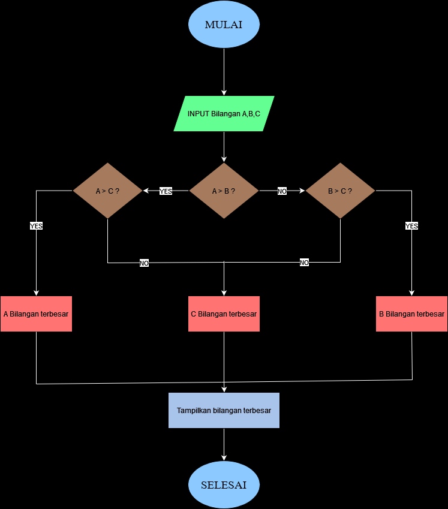

# Program Mencari Bilangan Terbesar

Program sederhana untuk mencari nilai terbesar dari sekumpulan bilangan yang dimasukkan oleh pengguna menggunakan loop while True dan break statement.

## Deskripsi Program
Program ini dibuat menggunakan bahasa Python dengan fitur:

- Menggunakan while True untuk perulangan tak terbatas
- Menggunakan break statement untuk menghentikan program
- Membandingkan setiap input dengan nilai maksimum yang tersimpan
- Menampilkan bilangan terbesar yang ditemukan

 ## Flowchart
 

 ## Kode Programan
 ```python
bilangan_max = 0
while True:
    bilangan = int(input('masukkan bilangan:'))
    if bilangan == 0 :
        break
    if bilangan > bilangan_max:
        bilangan_max = bilangan

print(f'bilangan terbesar: {bilangan_max}')
```
 ## Contoh Output
```bash
PS C:\Users\gtm42\OneDrive\Dokumen\piton> python -u "c:\Users\gtm42\OneDrive\Dokumen\piton\Praktikum3.py"
masukkan bilangan:200
masukkan bilangan:5654
masukkan bilangan:3842
masukkan bilangan:6969
masukkan bilangan:2111
masukkan bilangan:0
bilangan terbesar: 6969
```


# Program Menemukan Bilangan Terbesar dari 3 Variabel

Program untuk menentukan bilangan terbesar dari tiga angka yang diberikan oleh pengguna. Dengan menggunakan struktur kontrol sederhana, program ini akan membandingkan ketiga bilangan dan mengidentifikasi mana yang memiliki nilai tertinggi

## Deskripsi Program
Program ini dibuat menggunakan bahasa Python dengan fitur:


   - Minta pengguna untuk memasukkan tiga bilangan.
   - Simpan nilai-nilai tersebut ke dalam variabel.
  -  Bandingkan ketiga variabel menggunakan struktur if untuk menentukan nilai maksimum.
   - Tampilkan hasilnya ke layar.


 ## Flowchart
 

 ## Kode Programan
 ```python
a = int(input ("masukan angka: "))

b = int(input ("masukan angka: "))

c = int(input ("masukan angka: "))

if a > b:
    if a > c :
        terbesar = a
    else:
        terbesar = c       
else:
    if b > c:
        terbesar = b
    else:
        terbesar = c

print ( f"Bilangan terbesar adalah {terbesar}")
```
 ## Contoh Output
```bash
PS C:\Users\gtm42\OneDrive\Dokumen\piton> python -u "c:\Users\gtm42\OneDrive\Dokumen\piton\test.py"
masukan angka: 696
masukan angka: 969
masukan angka: 333
Bilangan terbesar adalah 969
```

## cara kerja program
Program ini dimulai dengan meminta pengguna untuk memasukkan tiga angka. Setelah angka-angka tersebut dimasukkan, program menggunakan fungsi if (Jika) untuk menentukan angka yang paling besar di antara ketiga angka tersebut. Fungsi if(Jika) secara otomatis membandingkan semua angka dan mengembalikan yang terbesar. Setelah menemukan angka terbesar, program menampilkan hasilnya kepada pengguna dengan kalimat yang jelas. Dengan cara ini, kode menjadi lebih ringkas dan mudah dibaca, tanpa perlu membuat banyak kondisi untuk perbandingan. melakukan pengecekan dengan urutan :

 Apakah A > B?
   - Jika ya: cek apakah A > C? Jika ya: A adalah terbesar
   - Jika tidak: C adalah terbesar
   - Jika tidak: cek apakah B > C?
   - Jika ya: B adalah terbesar
   - Jika tidak: C adalah nilai terbesar


## cara kerja program
variable max di isi dengan nilai 0, setelah itu terdapat variable inputan dengan nama bilangan, jika kondisi bilangan tidak sama dengan 0 maka cari bilangan lebih dari max dan variable max di set dengan bilangan tersebut. Jika bilangan lebih kecil dari max maka bilangan input kembali sehingga akan menghasilkan bilangan terbesar dari operasi tersebut.
