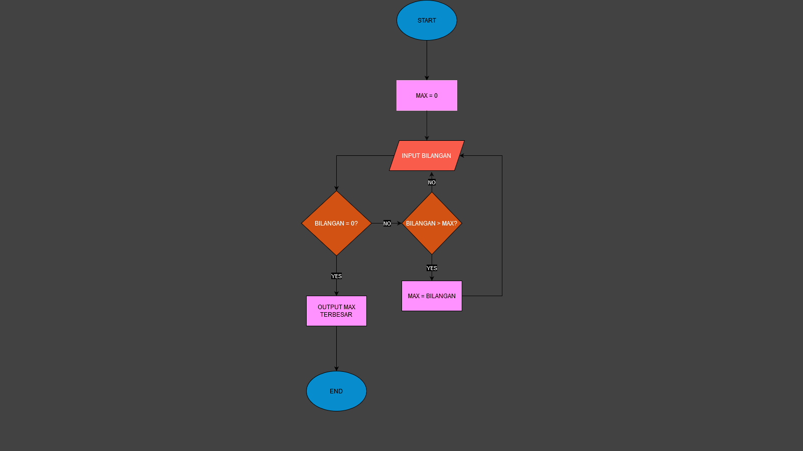

# Program Mencari Bilangan Terbesar

Program sederhana untuk mencari nilai terbesar dari sekumpulan bilangan yang dimasukkan oleh pengguna menggunakan loop while True dan break statement.

## Deskripsi Program
Program ini dibuat menggunakan bahasa Python dengan fitur:

- Menggunakan while True untuk perulangan tak terbatas
- Menggunakan break statement untuk menghentikan program
- Membandingkan setiap input dengan nilai maksimum yang tersimpan
- Menampilkan bilangan terbesar yang ditemukan

 ## Flowchart
 

 ## Kode Programan
 ```python
bilangan_max = 0
while True:
    bilangan = int(input('masukkan bilangan:'))
    if bilangan == 0 :
        break
    if bilangan > bilangan_max:
        bilangan_max = bilangan

print(f'bilangan terbesar: {bilangan_max}')
```
 ## Contoh Output
```bash
PS C:\Users\gtm42\OneDrive\Dokumen\piton> python -u "c:\Users\gtm42\OneDrive\Dokumen\piton\Praktikum3.py"
masukkan bilangan:200
masukkan bilangan:5654
masukkan bilangan:3842
masukkan bilangan:6969
masukkan bilangan:2111
masukkan bilangan:0
bilangan terbesar: 6969
```

## cara kerja program
variable max di isi dengan nilai 0, setelah itu terdapat variable inputan dengan nama bilangan, jika kondisi bilangan tidak sama dengan 0 maka cari bilangan lebih dari max dan variable max di set dengan bilangan tersebut. Jika bilangan lebih kecil dari max maka bilangan input kembali sehingga akan menghasilkan bilangan terbesar dari operasi tersebut.
